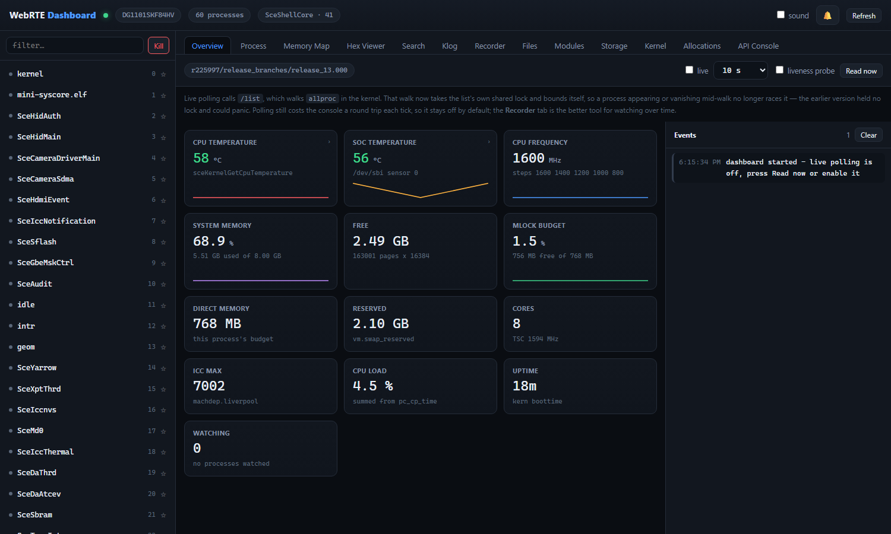
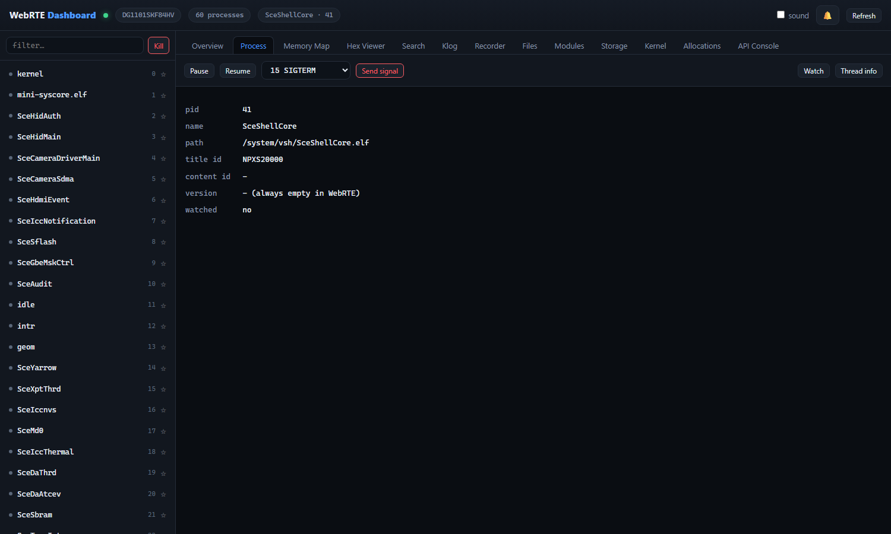
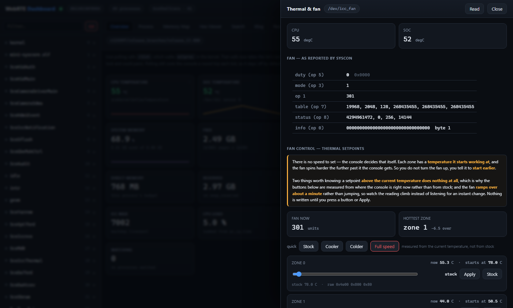
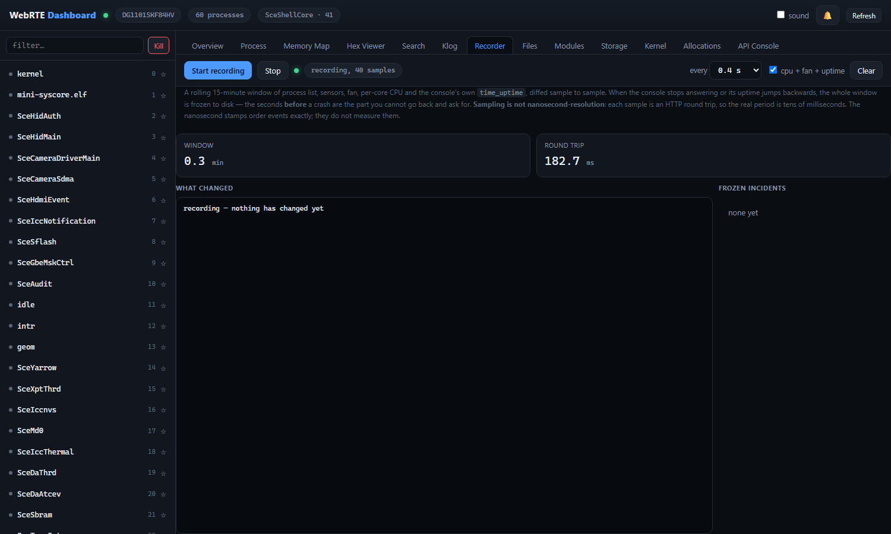
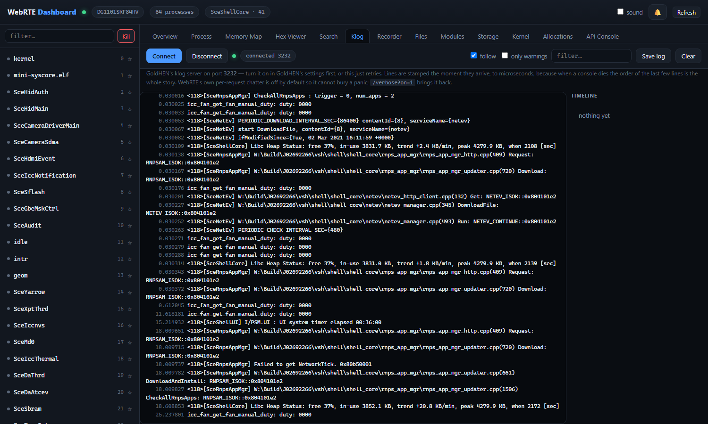
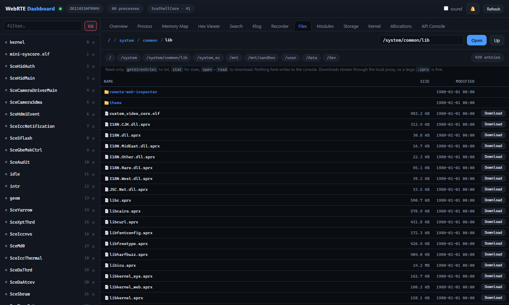
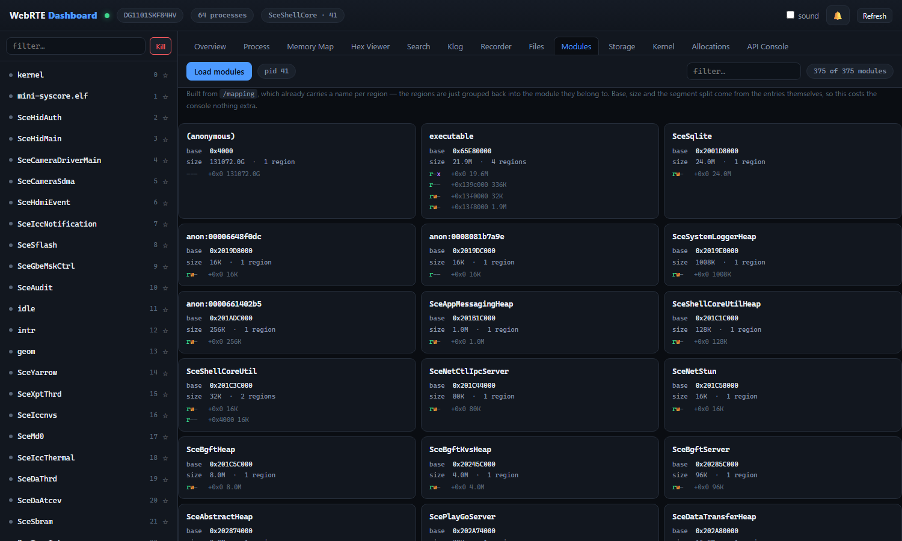
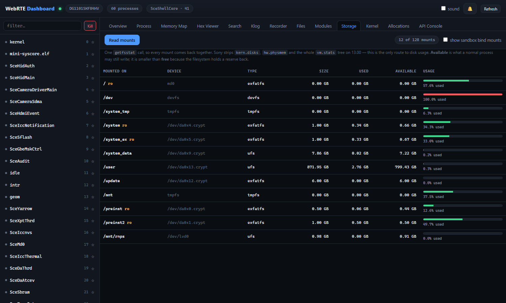
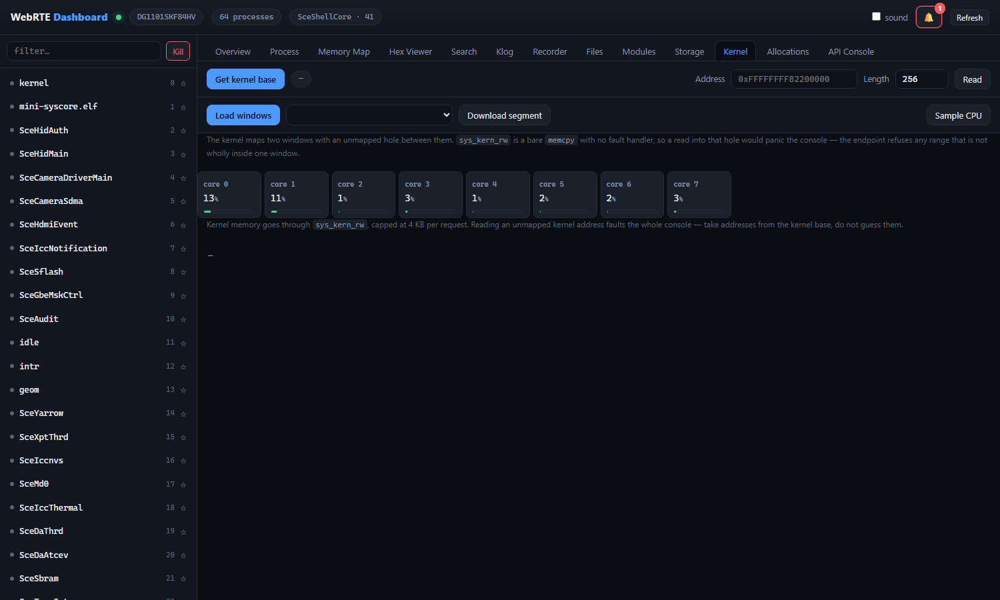
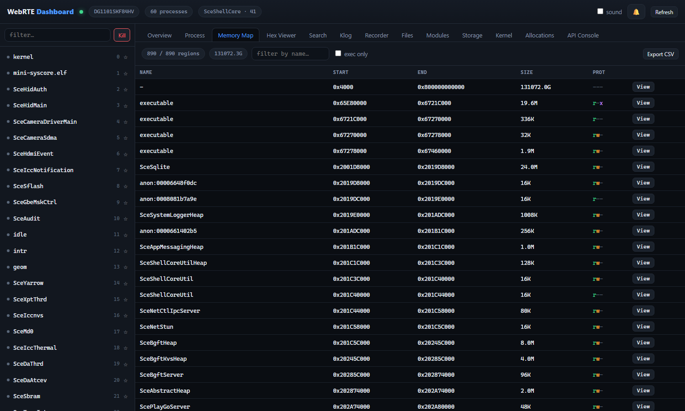

# WebRTE

Open-Source WebRTE Payload Coded By [golden](https://github.com/jogolden) For PS4 5.05, 6.72, 7.00 - 11.00 And 13.00 Firmware

Please Do not delete [golden](https://github.com/jogolden) Credits if you gonna modified it.

---

WebRTE is a payload you send to a jailbroken PS4. It opens an **HTTP server on port 771**
and answers plain `GET` requests with JSON, so anything that can fetch a URL can drive it —
a browser, `curl`, a Python script.

This fork adds **13.00 support**, a large set of new endpoints, and a full web dashboard
that turns the console into something close to a devkit: live sensors, per-core CPU, storage,
a file browser, a kernel dumper, the kernel log, and a flight recorder that freezes the last
15 minutes to disk when the console dies.



---

## Table of contents

- [Quick start](#quick-start)
- [Setting your console's IP](#setting-your-consoles-ip) ← **read this first**
- [Sending the payload](#sending-the-payload)
- [The dashboard](#the-dashboard)
  - [Overview](#overview) · [Process](#process) · [Thermal & fan](#thermal--fan) · [Recorder](#recorder) · [Klog](#klog)
  - [Files](#files) · [Modules](#modules) · [Storage](#storage) · [Kernel](#kernel) · [Memory map](#memory-map)
- [Pulling the kernel and files](#pulling-the-kernel-and-files)
- [API reference](#api-reference)
- [What is new in this fork](#what-is-new-in-this-fork)
- [Known limits](#known-limits)
- [Building](#building)
- [Credits](#credits)

---

## Quick start

**0. Get `webrte.bin`.** It is not in the repository — `*.bin` is a build artefact — so
download the latest one from
**[Releases](https://github.com/ap0calypse21/WebRTE/releases/latest)**, or
[build it yourself](#building).

```
curl -LO https://github.com/ap0calypse21/WebRTE/releases/latest/download/webrte.bin
```

Then three things, in order.

**1. Send the payload.** Console jailbroken with GoldHEN, payload receiver on port 9090:

```
python send.py 192.168.1.50
```

That sends `webrte.bin`, waits for port 771 to open, and reports how many
processes the console came back with. If it does not come up, it tells you which
stage of the load failed.

**2. Start the dashboard** on your PC:

```
python dashboard/serve.py --ip 192.168.1.50
```

Your browser opens at `http://127.0.0.1:8080/`.

Nothing here needs installing — Python 3 and its standard library, no packages.

---

## Setting your console's IP

**Every example here uses `192.168.1.50` as a placeholder. Yours will be different.**
Find it on the console: *Settings → Network → View Connection Status → IP Address*.

There are three places the address appears, and getting the wrong one is the most common
reason nothing works:

| Where | How to set it |
|---|---|
| Dashboard | `python dashboard/serve.py --ip 192.168.1.50` |
| `pull.py` | `python dashboard/pull.py --ip 192.168.1.50 kernel` |
| Direct API calls | `http://192.168.1.50:771/list` |

If you would rather not type it every time, edit the default at the top of
`dashboard/serve.py`:

```python
ap.add_argument("--ip", default="192.168.1.50", help="console address")
```

Three more things that trip people up:

- **It is `http://`, never `https://`.** The console does not speak TLS. If your browser
  upgrades the address, the connection is accepted and then goes silent with no error.
- **The payload does not survive a reboot.** Every restart means sending `webrte.bin` again.
- **Your PC and the console must be on the same network.** A PS4 on Wi-Fi and a PC on a
  different subnet will not see each other.

---

## Sending the payload

`webrte.bin` is a flat binary payload. GoldHEN's payload receiver listens on **port 9090** —
send the file to it and it runs.

**`send.py`** — any platform with Python 3, and it verifies the result:

```
python send.py 192.168.1.50
python send.py 192.168.1.50 --payload path/to/webrte.bin
python send.py 192.168.1.50 --no-wait
```

**`send.sh`** — Linux and macOS, uses `socat` or `nc`:

```
./send.sh 192.168.1.50
```

**With netcat directly**, if you prefer:

```
nc 192.168.1.50 9090 < webrte.bin
```

**From the console itself:** GoldHEN's own payload menu, or any of the usual payload
loaders on the PS4 browser.

Watch the klog (port 3232) while it loads — you should see WebRTE announce itself. If the
console hangs instead, the klog's last line tells you which stage failed.

> **Order matters.** Load GoldHEN first, then WebRTE. WebRTE applies only the four kernel
> patches its own machinery needs; the SELF, ACMgr, ptrace and ASLR patches it used to
> apply on top of GoldHEN's are gone, because applying both sets over the same code paths
> powered the console off the moment any app or disc was launched.

---

## The dashboard

`dashboard/serve.py` serves the page and proxies the API. The browser only ever talks to
`127.0.0.1`, which removes every CORS and mixed-content problem in one move — and the proxy
streams, so a 33 MB kernel dump passes through without being buffered in memory.

```
python dashboard/serve.py --ip 192.168.1.50
python dashboard/serve.py --ip 192.168.1.50 --port 9000 --no-browser
```

Every tab is addressable: `http://127.0.0.1:8080/?tab=rec&auto=1` opens the recorder and
pulls a first round of data. Handy as a bookmark.

### Overview

Temperatures, CPU frequency and load, memory, uptime, and the console model. Clicking the
CPU or SoC temperature card opens the thermal drawer.


`CPU load` is summed from each core's `pc_cp_time` and `Uptime` from the kernel's
`time_uptime` — Sony strips both `kern.cp_time` and `kern.boottime` on 13.00, so these are
read straight out of kernel memory.

### Process

The selected process in detail: path, title id, content id, threads, and the controls —
pause, resume, signal, and kill.



### Thermal & fan

`/dev/icc_fan` is a real character device. Its ioctl handler forwards nine commands to
SYSCON's fan service, and one of them carries the kernel's own string
`icc_fan_get_fan_manual_duty` — which is how the get/set duty pair was identified.



| op | ioctl | what it does |
|---|---|---|
| 0 | `0xC0168F01` | info block, 16 bytes |
| 1 | `0xC0148F02` | current fan value |
| 2 | `0xC0048F03` | set pair **(writes)** |
| 3 | `0xC0048F04` | get byte |
| 4 | `0xC0068F05` | **set manual duty (writes)** |
| 5 | `0xC0068F06` | get manual duty |
| 6 | `0xC01C8F07` | **set table (writes)** |
| 7 | `0xC01C8F08` | get table |
| 8 | `0xC0148F09` | status |

> ### ⚠ Read before touching the fan
>
> Writing to SYSCON **bypasses the console's automatic thermal control**. Raising the fan
> cools harder and is the safe direction; lowering it is how hardware gets damaged.
>
> Opcode 6 is the dangerous one. Sending it with an all-zero table pins the fan at full
> speed, and **SYSCON latches that** — restoring the original table does not bring the speed
> back down. Only a restart clears it. The panel now refuses to send an all-zero table at
> all, pre-fills the six values from the console, and keeps a **Restore table** button
> holding whatever was read when you opened it.
>
> Nothing here writes unless you click.

### Recorder

A rolling 15-minute window of process list, sensors, fan, per-core CPU, and the console's own
`time_uptime` — diffed sample to sample so you see **what changed**, not a wall of numbers.



When the console stops answering, or its uptime jumps backwards, the whole window is frozen
to `dashboard/incidents/` along with the surrounding klog lines. That directory is created on
first use and is not tracked by git, so your captures stay local. The seconds *before* a crash
are the part you cannot go back and ask for.

```
proc-  exited: eboot.bin (pid 91)
temp   cpu 54 -> 61 C
slow   sample took 1840 ms (was 71)
reboot uptime went 903s -> 4s: the console restarted
gone   console stopped answering
```

**Analyse** on a frozen incident lays out the last good sample, the changes leading up to it,
and every klog line within ±10 seconds of the trigger, each offset from the moment it happened.

The sampling loop lives in `serve.py`, not the page, so it keeps running while the tab is
hidden, while the browser reloads, and while the console is dying.

> **On resolution, plainly.** Every sample is an HTTP round trip to a console that handles
> one connection at a time at roughly 60 ms per request, so the real sampling period is tens
> of milliseconds — **not nanoseconds**. Timestamps are `perf_counter_ns`, which makes the
> *ordering* of events exact; it does not make the interval small. The one genuinely precise
> signal is `time_uptime` going backwards: that is a reboot, with no interpretation needed.

Light ticks read `/list` and `/sensors`; every fourth tick adds the kernel reads and the fan.
That keeps the console busy about **13%** of the time instead of 73%, and the loop stretches
its own period automatically if the console starts responding slowly.

### Klog

GoldHEN's kernel log server on port **3232**, with arrival timestamps to the microsecond,
severity colouring, a filter, and a timeline that pairs log events with processes appearing
and disappearing.



- **Turn the klog server on in GoldHEN's settings first**, or this just retries.
- **It accepts one client at a time.** Close `klog.py` or any other listener before
  connecting, or the two will fight over the port — the bridge detects this and says so.
- WebRTE's own per-request chatter (`accepted a new client`, `request path`, `dispatching`,
  `sent response`) is **off by default** so it cannot bury a panic. `GET /verbose?on=1`
  brings it back.

The severity patterns are deliberately narrow. An earlier version matched `terminat` and
`crash`, which turned one ordinary reboot into fifty alerts — SceShellUI logs a hundred
"Disposing JobQueue … on terminate" lines and owns a scene literally named `CrashReport`.
A matcher that cries wolf is worse than none.

### Files

Browse the console's filesystem and download anything. `getdirentries` to list, `stat` for
sizes, `open` + `read` to fetch. **Read-only — nothing here writes to the console.**



Shortcuts for `/system/common/lib`, `/mnt/sandbox`, `/user` and the rest. This is the single
biggest lever for research: you read the actual binaries instead of guessing at them.

### Modules

Every loaded module for the selected process, grouped from the memory map: base address,
size, and the segment split with permissions.



### Storage

Every mount, from one `getfsstat` call. Sony strips `kern.disks`, `hw.physmem` and the whole
`vm.stats` tree on 13.00, so there is no sysctl route to disk usage — this is it.



The console reports about 128 mounts and roughly 120 of them are `nullfs` bind mounts of the
same few filesystems into each sandbox. Those are hidden by default; tick **show sandbox
bind mounts** to see them. `Available` is smaller than `free` because the filesystem holds a
reserve back.

### Kernel

Kernel base, arbitrary reads, per-core CPU sampling, and a dumper.



### Memory map

Every mapped region for the selected process with permissions, jump-to-hex, and filtering.



---

## Pulling the kernel and files

`dashboard/pull.py` does the bulk transfers the browser cannot.

```
python dashboard/pull.py --ip 192.168.1.50 kernel
python dashboard/pull.py --ip 192.168.1.50 file /system/common/lib/libkernel.sprx
python dashboard/pull.py --ip 192.168.1.50 dir  /system/common/lib
python dashboard/pull.py elf kernel_live.bin
```

`kernel` writes three files: the raw dump, a `.json` sidecar recording where each window came
from, and **`kernel_live.elf` — load that one in IDA or Ghidra.**

The ELF matters. The 13.00 kernel maps two windows with an unmapped `0x8218A8` hole between
them. Written back to back in a flat file they sit next to each other instead, and every data
address then reads low by that gap — wrong in a way nothing warns you about. The ELF puts both
segments at their real addresses.

**A live dump is not the firmware file.** It is the kernel as it is running. Comparing one
against a static image shows exactly what is patched:

```
+0x19..0x171   pointers relocated by KASLR
+0x4B5 +0x4B9  72 13 / 75 0f  ->  eb 00   conditional jumps forced
+0x1B76E3      0f 85 0b 02 ..  ->  90 x6   authentication checks nopped
```

> `/kdump` refuses any range not wholly inside one of the two mapped windows.
> `sys_kern_rw` is a bare `memcpy` with no fault handler, so a read into the hole between
> them would panic the console rather than return an error.

---

## API reference

Everything is a `GET`. Nothing needs a body.

### Processes

| Endpoint | Notes |
|---|---|
| `/list` | every process: pid and name |
| `/info?pid=N` | name, path, title id, content id |
| `/mapping?pid=N` | mapped regions with names and permissions |
| `/thrinfo?pid=N` | thread id, priority, name |
| `/read?pid=N&address=A&length=L` | process memory, base64 |
| `/write?pid=N&address=A&data=B64` | **writes** |
| `/alloc?pid=N&length=L` · `/free?pid=N&address=A&length=L` | **writes** |
| `/pause?pid=N` · `/resume?pid=N` | **writes** |
| `/signal?pid=N&sig=S` | **writes**, signals 1–31 only |

### System

| Endpoint | Notes |
|---|---|
| `/sensors` | temperatures, frequency, memory, firmware string |
| `/sysctl?name=X` | any readable sysctl, as int, string and hex |
| `/storage` | every mount: size, free, available, type |
| `/fan` | read-only fan summary |
| `/fan?op=N&idx=0&…` | one ioctl by number — ops 2, 4 and 6 **write** |
| `/verbose?on=1` | turn per-request klog chatter back on |

### Files

| Endpoint | Notes |
|---|---|
| `/ls?path=P` | directory listing with sizes and mtimes |
| `/fstat?path=P` | size, mode, owner, mtime |
| `/dl?path=P&offset=O&length=L` | raw bytes; offset and length optional |

### Kernel

| Endpoint | Notes |
|---|---|
| `/kernbase` | the current kernel base — changes every boot |
| `/kread?address=A&length=L` | kernel memory, base64, 4 KB per request |
| `/kdump` | reports the mapped windows |
| `/kdump?address=A&length=L` | raw kernel bytes, up to 8 MB, window-checked |

> Kernel addresses are 64-bit and exceed JavaScript's `Number.MAX_SAFE_INTEGER`. Parse
> `/kernbase` out of the raw text as a `BigInt`; `JSON.parse` rounds it, and every offset you
> add afterwards then lands on the wrong page.

---

## What is new in this fork

**13.00 firmware support.** New kernel offsets, a fourth firmware table for libkernel's
thread-creation symbols, and section headers stripped from the embedded kdebugger ELF where
they collided with relocated code.

**A reduced kernel patch set.** Only the four patches WebRTE's own machinery needs —
`kmem_alloc` protection ×2, the `vm_map_protect` check, and the `memcpy` stack guard. The
eight inherited from ps4debug (`sceSblACMgr` ×3, sysdump, SELF, `ptrace` ×2, ASLR) are gone.
They overlapped GoldHEN's own hooks on the SELF load path, and launching any app or disc
with both sets applied powered the console off.

**A locked `allproc` walk.** The process walk now takes the list's shared lock and bounds
itself, instead of racing anything created or destroyed mid-walk.

**Percent-decoded query parameters.** Nothing decoded them before, so a path of `/` — which
every browser sends as `%2F` — reached `open()` as three literal characters.

**A quiet klog.** Four lines per request used to bury a panic behind routine traffic.

**New endpoints:** `/storage`, `/ls`, `/fstat`, `/dl`, `/kdump`, `/fan`, `/sensors`,
`/sysctl`, `/signal`, `/thrinfo`, `/kernbase`, `/kread`, `/verbose`.

**The dashboard**, `serve.py`, `klogbridge.py`, `recorder.py` and `pull.py`.

---

## Known limits

- The payload does not survive a reboot.
- The console speaks HTTP, not HTTPS.
- One klog client at a time.
- `/kread` is capped at 4 KB per request, `/kdump` at 8 MB.
- Sampling resolution is bounded by HTTP round trips, not by the timestamps.
- 13.00 offsets are hardcoded for 13.00. Other firmwares use their own tables.
- Only one program can hold the klog port. The dashboard and a standalone
  listener cannot both be connected.
- `libkernel_web` offsets for 13.00 are still unidentified, and 26 ksdk symbols are
  deliberately left NULL rather than guessed.

---

## Building

GitHub Actions builds `webrte.bin` and attaches it to a release on every push that
touches the payload. Changes confined to `dashboard/`, `README.md`, `LICENSE` or the
workflow itself do not trigger a build, since none of them change the binary — use the
Actions tab's **Run workflow** button if you want one anyway.

To build locally you need `gcc` and `objcopy` for x86-64, and the submodules:

```
git clone --recursive https://github.com/ap0calypse21/WebRTE
cd WebRTE
./build.sh
./build.sh clean     # rebuild everything from scratch
```

The result is `webrte.bin` in the repository root.

---

## Credits

- [jogolden](https://github.com/jogolden/ps4debug) - for originally creating this
- [DeathRGH](https://github.com/DeathRGH/frame4) - for multi fw example
- [BestPig](https://github.com/BestPig) - Help with offsets
- [EchoStretch](https://github.com/EchoStretch/ps4debug) - Putting it all together
- MasterMaind - 13.00 offsets and support, the dashboard, and everything in
  [what is new](#what-is-new-in-this-fork)
